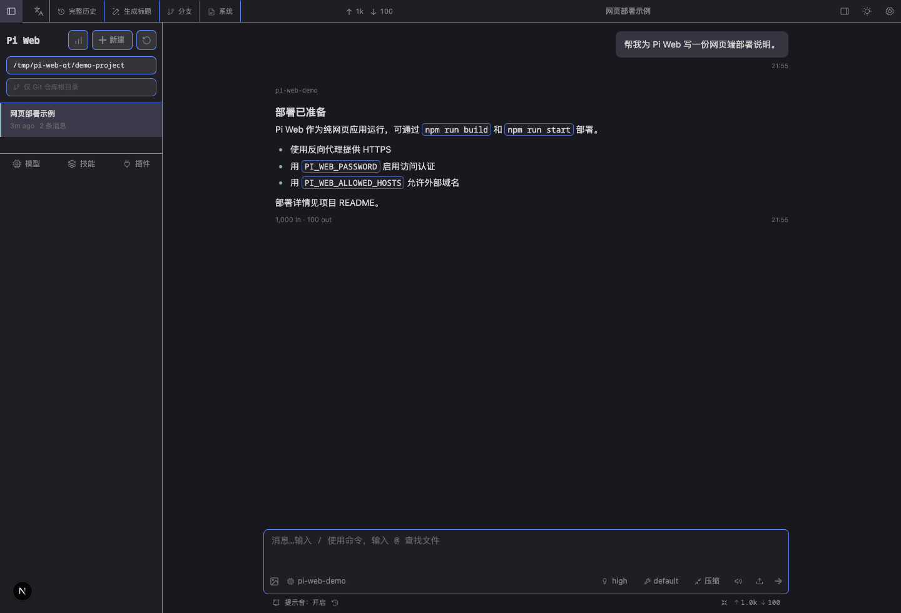
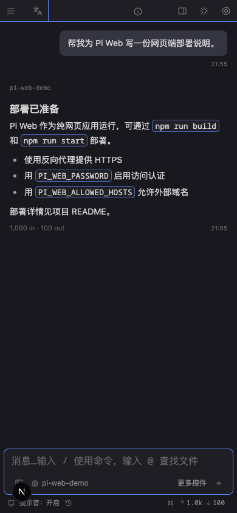

<div align="center">

# Pi Web

**Pi coding agent 的纯网页工作台**

读取本机 Pi 会话，提供实时对话、项目文件浏览、模型/技能/插件配置、Git Worktree 与移动端界面。该仓库只发布 Web 服务，不再提供 Electron 桌面应用或安装包。

[English](./README.en.md)


</div>

## 界面预览



<p align="center">
  
</p>

## 功能

| 能力 | 说明 |
| --- | --- |
| 实时对话 | 通过 SSE 显示 Pi Agent 的流式输出、工具调用、思考过程与错误状态。 |
| 会话管理 | 按项目查看会话，支持会话内分支、Fork、重命名、删除、AI 自动生成标题与 HTML 导出。 |
| 会话导入 | 从 Reasonix 等工具导入历史对话记录，自动发现项目与会话，支持合并或新建项目。 |
| 项目与文件 | 通过目录选择器加载项目，浏览文件、Diff、图片、音频、PDF、DOCX。 |
| 模型与认证 | 在网页中管理模型、OAuth/API Key、连通性测试和默认模型；支持从供应商自动获取模型列表与 models.dev 定价预设一键填入。 |
| 备份恢复 | 一键导出/导入核心配置、技能、插件、MCP 服务器与会话（可选含密钥），跨平台自动适配路径与命令。 |
| 技能与插件 | 查询、安装、启停 Skills 与 package 插件。 |
| Git Worktree | 在同一项目下创建、切换和移除 Worktree。 |
| 任务看板 | 桌面端四列看板：把任务交给 agent 在 worktree 分支中执行，支持验收、合并、归档、每项目设置（Beta）。 |
| 主题与语言 | 支持 Pi TUI 主题、亮暗模式及中文/English。 |
| 移动端 | 适配 Safari/Chrome 窄屏布局；模型选择和发送操作保持可见。 |

## 任务看板（Beta）

桌面端（非移动端）点击标题栏的看板按钮（四宫格图标）即可在聊天与任务看板之间切换。看板把「给 agent 派活」变成了一个可跟踪、可验收、可归档的流水线。

### 状态与四列

任务按状态落入四列：

| 列 | 状态 | 说明 |
| --- | --- | --- |
| 待办 | `todo` | 已创建、等待启动 |
| 进行中 | `queued` / `preparing` / `running` | 排队中、创建 worktree 中、agent 执行中 |
| 待处理 | `awaiting_input` / `review` / `merging` / `failed` | 需要你处理：等待输入、待验收、合并中、失败 |
| 已完成 | `done` / `canceled` | 完成或取消（取消默认隐藏，可在筛选里打开） |

一条任务的完整生命周期：**创建 → 启动 → 执行 → 待验收 → 合并 → 已完成**。

### 使用流程

1. **新建任务**：点击「新建任务」，选择项目、填写标题与任务说明（prompt）。可把常用任务存为模板复用。
2. **启动**：点击卡片上的「开始」，引擎会自动在该项目的 `-worktrees` 目录下创建独立分支（`task/<id>-<slug>`），在其中启动 agent 执行。也可以把待办卡片**拖到「进行中」列**直接启动；「全部启动」会排队当前项目的全部待办任务。
3. **执行与等待**：任务运行时可随时点「取消」；agent 需要你输入时会进入「等待输入」状态。
4. **验收**：agent 完成后任务进入「待处理」列（顶部标题栏会出现红色待处理计数徽章，窗口未激活时还会收到系统通知）。点卡片打开详情抽屉：查看变更文件、Diff、完整时间线；配置了预检命令的项目会显示验收红绿灯。
   - **合并**：接受产出，可选择自动/手动提交信息、是否删除 worktree。合并由 agent 在会话内完成，成功后任务进入「已完成」。
   - **退回**：不满意时填写反馈退回给 agent 继续修改。
5. **归档**：已完成/失败/取消的任务可归档（默认隐藏，筛选里可显示）；「全部归档」一键清空已完成列。
6. **失败处理**：失败任务显示错误信息，可「重试」（换新代际重新执行）或「编辑」后重新启动；取消的任务可「重新排队」回到待办。

### 任务设置

看板标题栏的「任务设置」按项目配置执行行为（独立于主设置弹窗）：

| 设置 | 说明 |
| --- | --- |
| 自动处理排队任务 | 开启后任务一排队即自动启动 |
| 最大并发任务数 | 每项目同时执行的上限（0 = 不限） |
| 合并策略 | 合并提交（merge commit）或压缩提交（squash） |
| 合并后删除 worktree（默认） | 合并完成后自动清理 worktree 与分支 |
| 预检命令（验收检查） | 任务进入待验收前在 worktree 中运行的命令，输出红绿灯结果（如 `npm test`） |
| 初始化命令 | agent 启动前在 worktree 中执行（如 `pnpm install`） |
| 阶段提示词 | 执行 / 重试 / 退回 / 合并各阶段的附加指令 |

### 技术说明与限制

- 任务存储于 `~/.pi/agent/tasks/`（JSONL，原子写），与会话文件同级；任务会话与其他会话一样可在会话列表查看。
- 每个任务在独立 git worktree 分支中执行，互不干扰；**任务 agent 被明确约束不得提交/推送其他分支或工作区的改动**。
- 引擎由服务器进程持有（单实例锁），重启后自动恢复中断的任务（标记为失败/中断，可重试）。
- Beta 阶段：仅在桌面端显示入口；移动端不可用。

## 最新更新（2026-08-05）

- **任务看板（Beta，桌面端）**：标题栏新增看板按钮，四列看板（待办/进行中/待处理/已完成）把任务交给 agent 在独立 git worktree 分支中执行；支持拖拽启动、详情抽屉（时间线/Diff/变更文件）、验收合并、退回反馈、归档、任务模板、每项目任务设置（并发/合并策略/预检/初始化命令/阶段提示词）、系统通知与中英文/主题适配。任务存于 `~/.pi/agent/tasks/`（JSONL）。
- **内置模型配置持久化修复**：内置供应商模型编辑（上下文窗口 / 最大输出 / 思考映射 / 名称 / 隐藏）改为写入 SDK 原生 `modelOverrides` 字段级覆盖，不再整模型替换，也不会重置未修改字段；`models.json` 读写加互斥锁与原子写，局部保存和全局保存互不覆盖。
- **草稿保护**：切换供应商、点击全局保存或关闭设置前会自动保存未提交的内置模型修改；保存失败保留草稿并提示，不再静默丢失。兼容历史 `models[]` 配置，自定义与传输字段原样保留。
- **备份导入修复**：修复超过 10MB 的备份包导入被截断（413）的问题，上传上限与导入接口对齐（600MB）；导入按钮改为标准按钮样式，不再像纯文字。
- **Reasonix 会话导入增强**：除原有 `~/.reasonix/projects/` 布局外，新增支持 Windows/CLI 平铺的 `~/.reasonix/sessions/` 布局（按文件名前缀自动发现 code / desktop 等项目）；对非 mac 命名格式的文件名做解析容错。
- **项目选择**：左上角项目选择模块始终显示（含新装用户），侧边栏不再出现重复的独立按钮；无项目占位文案改为随界面语言（中文"选择项目…"）。
- **会话导入**：设置弹窗新增「导入会话」标签页，自动发现 `~/.reasonix/projects/` 下的项目与历史会话，支持按项目勾选批量导入，可选择合并到现有项目或新建项目；导入后可选调用模型生成标题。
- **Windows 兼容修复**：修复全新安装（无历史会话）时项目选择器消失的问题；修复 `~` 路径缩写和快捷工作区识别的大小写敏感问题。

## 历史更新（2026-08-04）

- **跨平台备份恢复**：设置弹窗新增「备份」标签页，一键导出/导入核心配置、技能、插件、MCP 与会话；导入按平台自动适配路径与命令，支持类别勾选与 MCP 跳过。
- **自动生成会话标题**：会话列表新增“生成标题”按钮，基于会话内容调用模型命名；可全局指定标题生成模型。
- **内置模型覆盖**：模型配置可查看供应商内置模型明细并叠加 models.json 自定义覆盖项。
- **安全加固**：auto-name / settings / models-config 等 API 补齐请求鉴权；备份导入增加解压炸弹防护（单条目/总量双重上限 + 实际字节校验）、脚本白名单、路径穿越校验与 npm 插件 opt-in 重装。
- **供应商获取模型**：模型配置中可直接从供应商的 Base URL 拉取模型列表（支持 OpenAI / Anthropic / Google 等协议），筛选、多选后一键添加，无需手写模型 ID。
- **models.dev 定价预设**：填写模型 ID 后一键从 models.dev 拉取名称、上下文窗口、价格等字段填入，支持撤销；价格来源与可信度一目了然。
- **对话滚动跟随**：修复 agent 运行时消息列表跳到底部空白的问题；流式输出期间停留在列表底部则自动跟随，滚到上方查看历史不被打断，且最后一条消息与输入框之间保留间距。
- **快捷操作**：文件标签页支持中间键关闭；会话删除支持 Shift+点击跳过确认；Markdown 中的本地图片可直接预览。
- **URL 直达目录**：通过 `?cwd=<路径>` 参数打开网页时直接校验并进入指定目录的新会话。

## 安装提示（npm 11）

使用 npm ≥ 11 安装本包时可能出现两类提示，均为**提示性警告，不影响安装与运行**：

- `ERESOLVE overriding peer dependency`：上游 `@lobehub/ui` 依赖的 `@emoji-mart/react@1.1.1` 的 peer 声明仅到 React 18，而本包使用 React 19。npm 会自动 override 并继续安装（实际兼容）。如需彻底消除，可在你的项目 `package.json` 添加：

  ```json
  "overrides": { "@emoji-mart/react": { "react": "$react" } }
  ```

- `allow-scripts`：npm 11 新增的安装脚本审批提示（sharp / protobufjs / @google/genai 等）。本项目已在包内声明 `allowScripts`，若你的 npm 仍提示，可执行 `npm approve-scripts --all` 审批，或在安装命令加 `--allow-scripts=sharp,protobufjs,@google/genai`。

## 最新更新（2026-08-03）

- **Web-only 基线**：界面和运行代码已统一为 `pi-web-desktop` 的网页基线；Electron 主进程、桌面端打包、PWA Service Worker 与 tag 驱动的桌面 Release 工作流已移除。
- **目录选择器**：侧栏“选择文件夹”改为可逐级浏览的目录弹窗，选择“此文件夹”后直接加载项目，不再要求手动输入路径。
- **移动端可用性**：当前模型和发送按钮始终显示；项目名、Git 仓库/Worktree 名在窄屏缩小并省略，避免横向滚动。
- **模型下拉稳定性**：展开或收起供应商二级模型列表时，面板外框保持固定高度，只有结果列表滚动，不再上下跳动。
- **QT 固定主题**：显示设置重新提供 Gruvbox、Nord、Tokyo Night、Solarized、One Dark、Dracula 与 Catppuccin；它们和 Pi JSON 自定义主题共存，均支持浅色、深色与跟随系统。
- **移动端输入区**：聊天输入框提高到 52px；保持 16px 防止 iOS Safari 聚焦缩放，同时以更紧凑的行高和字距降低文字视觉体积。
- **运行与渲染修复**：生产服务不再依赖 Turbopack 开发 chunk；Markdown 表格行引用保持合法 DOM 结构，避免 hydration 报错。

## 快速开始

### 前置条件

- Node.js **22.19.0 或更高版本**
- 已配置可用的 Pi 模型/认证信息

### 从 npm 安装（推荐）

```bash
npx @qt4798/pi-web@latest
```

或全局安装：

```bash
npm install -g @qt4798/pi-web
pi-web
```

然后打开 [http://127.0.0.1:30141](http://127.0.0.1:30141)。CLI 会在服务就绪后自动打开浏览器。默认只监听 `127.0.0.1`。

**更新：**

```bash
npm update -g @qt4798/pi-web
# 或指定版本
npm install -g @qt4798/pi-web@latest
```

**常用选项：**

```bash
pi-web --port 8080              # 自定义端口
pi-web --hostname 0.0.0.0       # 暴露在局域网
pi-web -p 8080 -H 0.0.0.0       # 组合使用
pi-web --no-open                # 不自动打开浏览器

PORT=8080 pi-web                # 也可通过环境变量设置端口
PI_WEB_HOSTNAME=0.0.0.0 pi-web  # 显式设置监听地址
PI_WEB_ALLOWED_HOSTS=piweb.example.com pi-web  # 允许反向代理域名
PI_WEB_PASSWORD='随机长密码' pi-web           # 启用 HTTP Basic Auth（用户名 pi）
PI_WEB_NO_OPEN=1 pi-web         # 后台服务不自动打开浏览器
```

设置 `PI_WEB_PASSWORD` 后，所有网页接口和 API 端点都需要 HTTP Basic Auth 认证，用户名为 `pi`。不设或留空则禁用认证。

> Basic Auth 不加密传输中的密码。请勿将纯 HTTP 直接暴露到公网，通过可信反向代理启用 HTTPS 或使用可信 VPN 进行远程访问。

### 从源码运行

```bash
git clone https://github.com/t479842598/pi-web-QT.git
cd pi-web-QT
npm ci
npm run dev
```

`npm run dev` 使用**随机端口**（`-p 0`），启动日志会打印实际地址，如 `http://127.0.0.1:<随机端口>`。本地仓库构建仅作为测试环境；日常命令行运行请使用 npm 全局安装的 `@qt4798/pi-web`（`pi-web` 命令，固定 `http://127.0.0.1:30141`）。

开发服务器默认只监听本机。局域网调试可使用：

```bash
npm run dev:lan
```

## 生产部署

完整部署步骤见 [docs/deployment.md](./docs/deployment.md)。最小流程：

```bash
npm ci
npm run build
PI_WEB_PASSWORD='替换为随机长密码' \
PI_WEB_ALLOWED_HOSTS='piweb.example.com' \
node bin/pi-web.js -H 127.0.0.1 -p 30141 --no-open
```

生产环境建议：

1. 让 Pi Web 仅监听 `127.0.0.1`。
2. 用 Caddy、Nginx 或 Cloudflare Tunnel 对外提供 HTTPS。
3. 设置 `PI_WEB_PASSWORD` 与精确的 `PI_WEB_ALLOWED_HOSTS`。
4. 用 systemd 或 launchd 守护 `node bin/pi-web.js` 进程。

### 环境变量

| 变量 | 用途 |
| --- | --- |
| `PI_WEB_PASSWORD` | 启用 HTTP Basic Auth；用户名固定为 `pi`。 |
| `PI_WEB_ALLOWED_HOSTS` | 以逗号分隔的外部允许域名，例如 `piweb.example.com`。 |
| `PI_CODING_AGENT_DIR` | 指向另一套 Pi 数据目录；默认使用 `~/.pi/agent`。 |
| `HTTP_PROXY` / `HTTPS_PROXY` / `NO_PROXY` | 为服务端模型/API 请求设置代理。 |
| `PI_WEB_NO_OPEN=1` | 禁止 CLI 在服务启动后自动打开浏览器。 |

## 目录选择与移动端

- 侧栏的“选择文件夹”会打开目录浏览器；逐层进入目录后，点击“选择此文件夹”加载项目。
- 移动端底部始终保留当前模型名称与发送按钮；思考、工具、压缩和提示音收纳在“更多控件”中。
- 长项目路径、仓库名和 Worktree 名会省略显示，避免窄屏横向滚动。

## 开发与验证

```bash
node_modules/.bin/tsc --noEmit
npm run lint
```

本地开发不要运行 `npm run build`；它会改写 `.next/` 并干扰 `npm run dev`。生产部署或 CI 可运行构建。

## 项目结构

```text
app/            Next.js App Router 与 API 路由
components/     会话、聊天、目录选择、文件预览和设置界面
hooks/          会话、主题、音频、移动端等前端状态
lib/            Pi SDK、会话读取、文件边界、Worktree 与配置逻辑
bin/pi-web.js   生产 Web 服务 CLI 入口
docs/           部署说明、截图与功能文档
```

## Web-only 说明

本仓库不含 Electron 主进程、安装向导、桌面端打包依赖或 GitHub Release 打包工作流。请使用浏览器访问部署后的 Pi Web 服务。

## 许可证

[MIT](./LICENSE)
